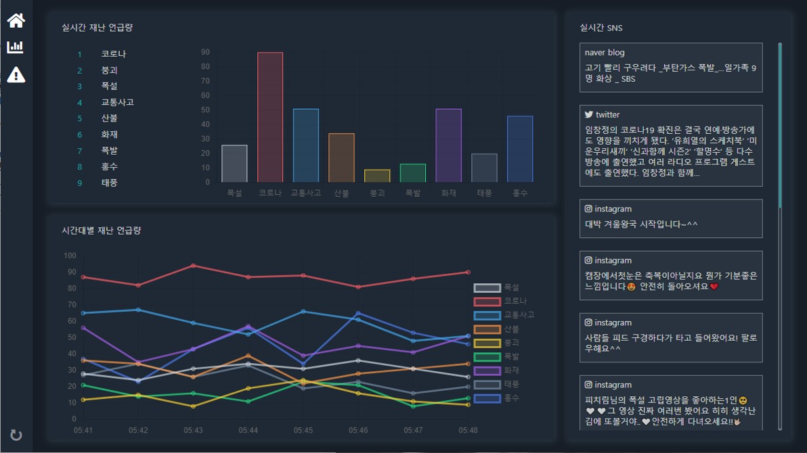
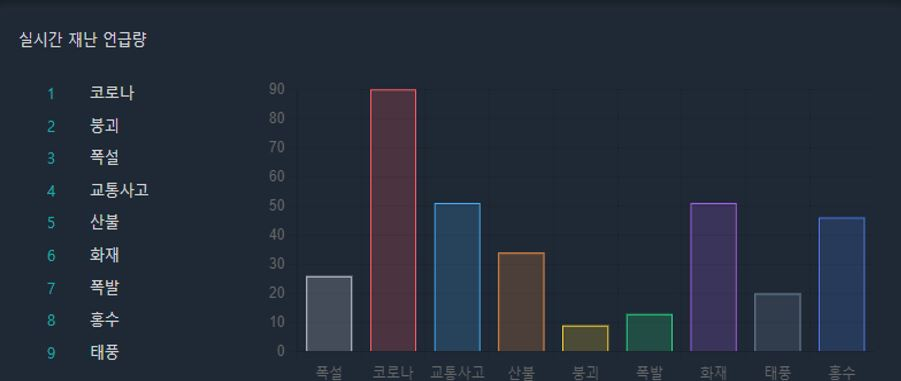
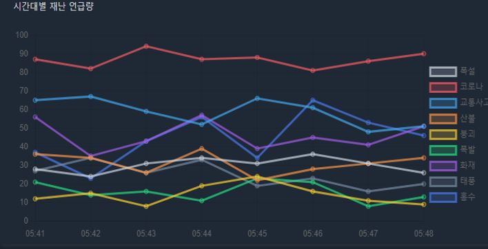
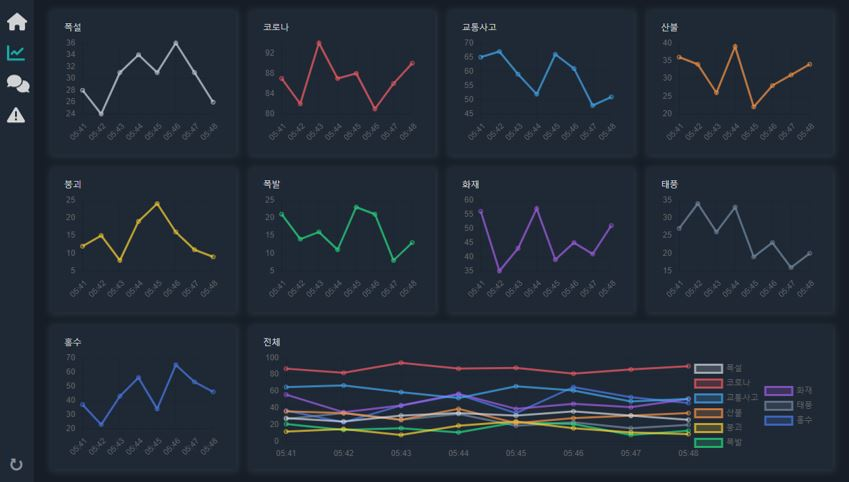
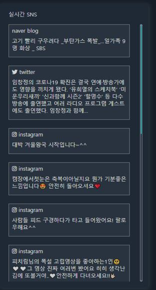
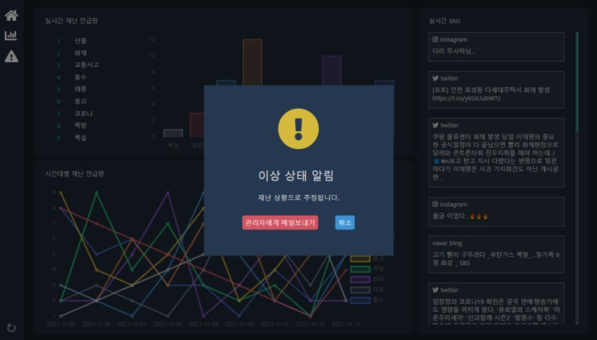
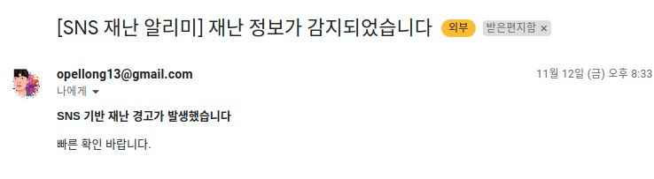

 
 <div align=center>
 
 <h3 align=right>TEAM moreAI</h3>
 </div>
 

## 📚목차
1. [📃 Description](#📃-description)
2. [🌍 Environment](#🌍-environment)
3. [📥 Usage](#📥-usage)
4. [🔉 APIs](#🔉-APIs)

## 📃 Description

>### Instragram, Naver blog, Twitter 상의 재난 관련 비정형 소셜 데이터를 수집해 실시간 재난 정보를 제공하는 서비스입니다.<br>

### dashboard
<br>

### 서비스 목록

* [실시간 재난 언급량 순위 제공](#실시간-재난-언급량-순위-제공)
* [시간대별 재난 언급량 제공](#시간대별-재난-언급량-제공)
* [실시간 SNS 트렌드 분석](#실시간-sns-트렌드-분석)
* [재난 상황 추정 시 이메일 전송](#재난-상황-추정-시-이메일-전송)


### 실시간 재난 언급량 순위 제공
<br>
실시간으로 SNS에서 언급되고 있는 재난들의 언급량 순위를 막대 그래프로 시각화해서 보여줍니다.
### 시간대별 재난 언급량 제공
<br>
<br>
시간대별로 SNS에서 재난이 언급된 횟수를 꺾은선 그래프로 시각화해서 보여줍니다.

### 실시간 SNS 트렌드 분석
<br>
sns 상의 비정형 언어 데이터를 nlp를 통해 필터링하여 재난과 관련되어 언급되고 있는 내용들을 실시간으로 나타냅니다.

### 재난 상황 추정 시 이메일 전송
<br>
<br>

특정 키워드의 언급량이 급격히 늘어났을 때, 관리자에게 메일을 전송합니다.<br>
또한 사용자가 메일을 직접 전송할 수도 있습니다. 

## 🌍 Environment

* Container: 
* proxy sever : 
* Language :     
* Framework :   
* Database:   

## 📥 Usage

```
 docker-compose up
```

### front setup
```
npm install
```

## 🔉 APIs

```
1. GET /api/instagram/data
```
* request
    - start: 불러올 인스타그램 게시물의 최소 게시 시각
    - end: 불러올 인스타그램 게시물의 최대 게시 시각
* response
    - data: 조건에 맞는 게시물 정보

```
2. GET /api/naver/data
```
* request
    - start: 불러올 네이버 블로그 게시물의 최소 게시 시각
    - end: 불러올 네이버 블로그 게시물의 최대 게시 시각
* response
    - data: 조건에 맞는 게시물 정보

```
3. GET /api/twitter/data
```
* request
    - start: 불러올 트위터 게시물의 최소 게시 시각
    - end: 불러올 트위터 게시물의 최대 게시 시각
* response
    - data: 조건에 맞는 게시물 정보

```
4. GET /mail
```
* request
* response
    -  200: 정상적으로 전송되었을 때

```
5. GET /model
```

* request
    - start: 분석할 게시물의 최소 게시 시각
    - end: 분석할 게시물의 최대 게시 시각
* response
    - data: 크롤링한 데이터중 nlp로 분석한 결과 재난 키워드와 관련되었다고 분석된 데이터


